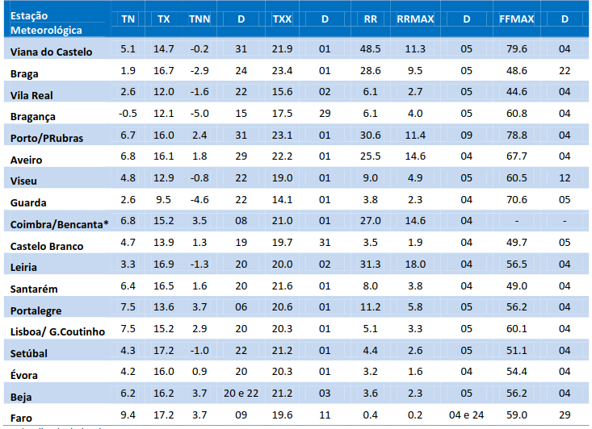
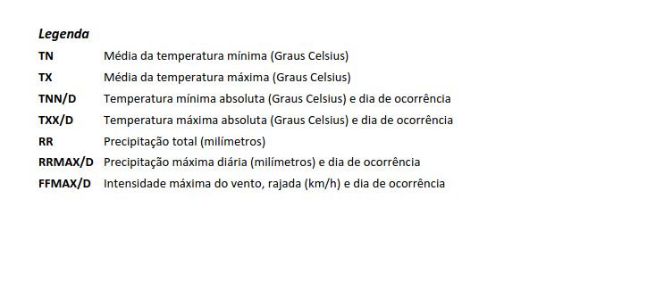
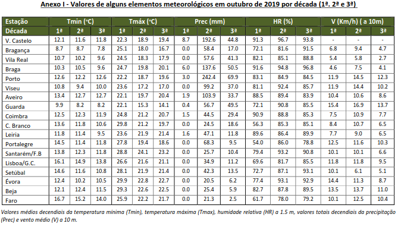
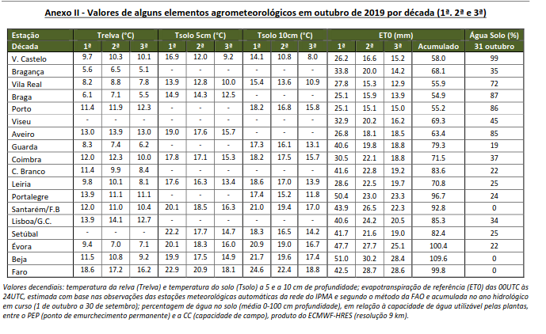

#Propriedades dos Sensores

- Documento de apoio ao desenvolvimento do projeto em relação às estações meteorológicas que contém os seguintes sensores:

####Sensor de Temperatura:
_Unidade: ºC (graus centígrados)_
_Intervalo de dados: {0,1,2,3,...} ºC_

Pode emitir dados:

- por dia
- por hora
- por ano (média)

####Sensor da Velocidade Vento:
_Unidade: km/h (quilómetros por hora)_
_Intervalo de dados: {0,1,2,3,...} km/h_

Pode emitir dados:

- por dia
- por hora

####Sensor da Direção Vento:
_Unidade: º (graus em relação ao Norte)_
_Intervalo de dados: {0,1,2,3,...,359} º_

Pode emitir dados:

- por dia
- por hora

#####Algumas correspondências dos graus em relação a direção do vento:
| Abreviatura | Direção do vento | Graus |
| ----------- | ---------------- | ------ |
| N | Norte | 0° |
| NNE | Nor-Nordeste | 22.5° |
| NE | Nordeste | 45° |
| ENE | Este-Nordeste | 67.5° |
| E | Este | 90° |
| ESE | Este-Sudeste | 112.5° |
| SE | Sudeste | 135° |
| SSE | Su-Sudeste | 157.5° |
| S | Sul | 180° |
| SSO | Su-Sudoeste | 202.5° |
| SO | Sudoeste | 225° |
| OSO | Oés-Sudoeste | 247.5° |
| O | Oeste | 270° |
| ONO | Oés-Noroeste | 292.5° |
| NO | Noroeste | 315° |
| NNO | Nor-Noroeste | 337.5° |

####Sensor da Humidade Atmosférica:
_Unidade: %_
_Intervalo de dados: {0,1,2,3,...,100} %_

Pode emitir dados:

- por dia
- por hora

####Sensor da Humidade Solo:
_Unidade: %_
_Intervalo de dados: {0,1,2,3,...,100} %_

Pode emitir dados:

- por dia
- por hora

####Sensor da Pluviosidade:
_Unidade: mm (milímetros)_
_Intervalo de dados: {0,1,2,3,...} mm_

Pode emitir dados:

- por hora (normalmente são calculados com de 3 horas em 3 horas)
- por ano (acumulado)

####Exemplos reais

######Figura1 - Temperatura Março 2022 S.Pilar

###### ------------------------------------------------------------------------------------

######Figura2 - Pluviosidade Março 2022 P.Rubras

###### ------------------------------------------------------------------------------------

######Figura3 - Resumo Mensal Janeiro

###### ------------------------------------------------------------------------------------

######Figura4 - Resumo Outubro de 2019 de alguns elementos

###### ------------------------------------------------------------------------------------

######Figura5 - Resumo Outubro de 2019 de mais alguns elementos
