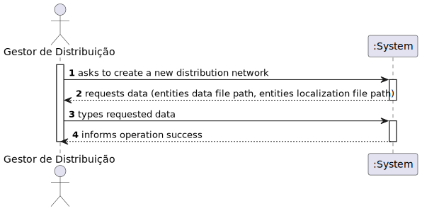
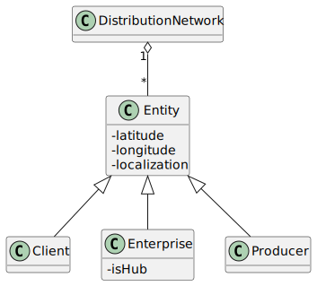

# US 301 - Construir a rede de distribuição de cabazes a partir da informação fornecida nos ficheiros

## 1. Requirements Engineering

_In this section, it is suggested to capture the requirement description and specifications as provided by the client as well as any further clarification on it. It is also suggested to capture the requirements acceptance criteria and existing dependencies to other requirements. At last, identify the involved input and output data and depicted an Actor-System interaction in order to fulfill the requirement._

### 1.1. User Story Description

Construir a rede de distribuição de cabazes a partir da informação fornecida nos
ficheiros. O grafo deve ser implementado usando a representação mais adequada e garantindo a
manipulação indistinta dos clientes/empresas e produtores agrícolas (código cliente: C, código
empresa: E, código produtor: P).

### 1.2. Customer Specifications and Clarifications

**From the specifications document:**

> Com recurso às classes que implementam a interface Graph crie um conjunto de classes e testes que permitam gerir uma rede de distribuição de cabazes entre agricultores e clientes.

> Os agricultores/produtores disponibilizam diariamente à rede de distribuição os produtos e respetivas quantidades que têm para vender e os clientes (particulares ou empresas) colocam encomendas (cabazes de produtos agrícolas) à rede de distribuição.

> Cada produto de um cabaz é fornecido por um só produtor, mas um cabaz pode ser fornecido por vários produtores.

> código cliente: C, código empresa: E, código produtor: P

### 1.3. Acceptance Criteria

- AC01: Garantir a manipulação indistinta dos clientes/empresas e produtores agrícolas

### 1.4. Found out Dependencies

No dependencies were found.

### 1.5 Input and Output Data

- Input:
  - _Path_ para o ficheiro de dados das entidades
  - _Path_ para o ficheiro de distâncias entre entidades
- Output:
  - A Distribution network with the data in the files

### 1.6. System Sequence Diagram (SSD)

_Insert here a SSD depicting the envisioned Actor-System interactions and throughout which data is inputted and outputted to fulfill the requirement. All interactions must be numbered._

### 1.7 Other Relevant Remarks

Not found.

## 2. OO Analysis

### 2.1. Relevant Domain Model Excerpt

## 3. Design - User Story Realization

### 3.1. Rationale

**The rationale grounds on the SSD interactions and the identified input/output data.**

| Interaction ID | Question: Which class is responsible for... | Answer | Justification (with patterns) |
| :------------- | :------------------------------------------ | :----- | :---------------------------- |
| Step 1         |                                             |        |                               |
| Step 2         |                                             |        |                               |
| Step 3         |                                             |        |                               |
| Step 4         |                                             |        |                               |
| Step 5         |                                             |        |                               |
| Step 6         |                                             |        |                               |
| Step 7         |                                             |        |                               |
| Step 8         |                                             |        |                               |
| Step 9         |                                             |        |                               |
| Step 10        |                                             |        |                               |

### Systematization

According to the taken rationale, the conceptual classes promoted to software classes are:

- Class1
- Class2
- Class3

Other software classes (i.e. Pure Fabrication) identified:

- xxxxUI
- xxxxController

## 3.2. Sequence Diagram (SD)

_In this section, it is suggested to present an UML dynamic view stating the sequence of domain related software objects' interactions that allows to fulfill the requirement._

## 3.3. Class Diagram (CD)

_In this section, it is suggested to present an UML static view representing the main domain related software classes that are involved in fulfilling the requirement as well as and their relations, attributes and methods._

# 4. Tests

_In this section, it is suggested to systematize how the tests were designed to allow a correct measurement of requirements fulfilling._

**_DO NOT COPY ALL DEVELOPED TESTS HERE_**

**Test 1:** Check that it is not possible to create an instance of the Example class with null values.

    @Test(expected = IllegalArgumentException.class)
    	public void ensureNullIsNotAllowed() {
    	Exemplo instance = new Exemplo(null, null);
    }

_It is also recommended to organize this content by subsections._

# 5. Construction (Implementation)

_In this section, it is suggested to provide, if necessary, some evidence that the construction/implementation is in accordance with the previously carried out design. Furthermore, it is recommeded to mention/describe the existence of other relevant (e.g. configuration) files and highlight relevant commits._

_It is also recommended to organize this content by subsections._

# 6. Integration and Demo

_In this section, it is suggested to describe the efforts made to integrate this functionality with the other features of the system._

# 7. Observations

_In this section, it is suggested to present a critical perspective on the developed work, pointing, for example, to other alternatives and or future related work._
